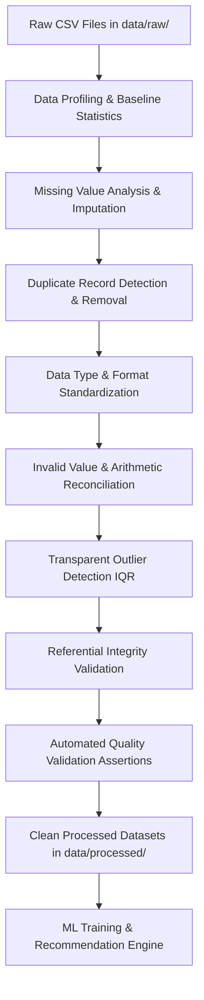

# STOCKSENSE Data Preprocessing & Cleaning Methodology Documentation

## Executive Overview
This document provides a comprehensive, evaluator-ready breakdown of the automated, reproducible data cleaning and preprocessing pipeline implemented for the **STOCKSENSE** Retail Demand Forecasting & Inventory Optimization system.

The entire pipeline is executed via a single Python command:
```bash
python scripts/data_cleaning.py
```

---

## 1. High-Level Architecture & Pipeline Workflow

Below is the Mermaid flowchart visualizing the end-to-end data transformation pipeline:



---

## 2. Dataset Collection & Input Overview

The raw datasets represent multi-store retail supermarket operations located in `data/raw/`:

| Dataset Name | File Path | Raw Rows | Raw Columns | Description |
| :--- | :--- | :---: | :---: | :--- |
| **`external_factors.csv`** | `data/raw/external_factors.csv` | 972 | 8 | Daily weather (`temp_c`, `rain_mm`), holidays, events per city |
| **`inventory.csv`** | `data/raw/inventory.csv` | 29,160 | 9 | Daily store-product inventory balances, orders, lead days |
| **`products.csv`** | `data/raw/products.csv` | 30 | 8 | Product catalog, pricing (MRP, cost price), shelf life, brand |
| **`stores.csv`** | `data/raw/stores.csv` | 4 | 6 | Retail store locations, floor area, average daily footfall |
| **`transactions.csv`** | `data/raw/transactions.csv` | 67,344 | 11 | Point-of-sale customer item purchases, prices, hours |

---

## 3. Step-by-Step Preprocessing Methodology

### Step 1: Data Profiling
- **Problem Detected**: Need baseline metrics on shape, data types, missingness, unique counts, and value ranges prior to transformation.
- **Detection Method**: Automated inspection via `pandas` (`df.info()`, `df.describe()`, `df.isnull().sum()`, `df.duplicated().sum()`).
- **Cleaning Method**: Executed `profile_raw_data()` helper function to calculate per-column metrics.
- **Reason for Choice**: Establishes objective empirical evidence before applying transformations.
- **Records Affected**: All 97,510 raw rows analyzed across 5 tables.
- **Output Artifacts**: `data/processed/data_profiling_report.csv` and `data/processed/data_profiling_report.txt`.

---

### Step 2: Missing Value Handling
- **Problem Detected**: 18 missing values in `temp_c` column of `external_factors.csv` (1.85% of records).
- **Detection Method**: `df['temp_c'].isnull().sum()` grouped by city.
- **Cleaning Method**: Imputed missing values using city-level time-series forward fill followed by backward fill (`df.groupby('city')['temp_c'].transform(lambda x: x.ffill().bfill())`).
- **Reason for Choice**: Temperature is temporally correlated within a city. Forward/backward filling preserves natural weather trends without fabricating synthetic values.
- **Records Affected**: 18 rows in `external_factors.csv`.

---

### Step 3: Duplicate Record Removal
- **Problem Detected**: 1 exact duplicate transaction row found in `transactions.csv`.
- **Detection Method**: `df.duplicated().sum()`.
- **Cleaning Method**: Dropped exact duplicate row using `df.drop_duplicates()`.
- **Reason for Choice**: Exact duplicate rows distort sales aggregates and model evaluation.
- **Records Affected**: 1 row in `transactions.csv`.

---

### Step 4: Data Type & Format Standardization
- **Problem Detected**: Dates stored as arbitrary text strings; trailing whitespace in categorical identifiers.
- **Detection Method**: Dtype inspection and string whitespace checking (`str.strip()`).
- **Cleaning Method**: Converted all date columns to standard ISO format (`YYYY-MM-DD`). Stripped leading/trailing whitespace from string columns (`product_id`, `store_id`, `category`, `payment_mode`).
- **Reason for Choice**: Standard ISO date strings ensure proper time-series sorting and reliable merge operations across datasets.
- **Records Affected**: All text & date fields across 5 datasets.

---

### Step 5: Categorical Value Normalization
- **Problem Detected**: Inconsistent capitalization in `category` column of `products.csv` (`'beverages'`, `'BEVERAGES'`, `'Beverages'`).
- **Detection Method**: `df['category'].unique()` inspection.
- **Cleaning Method**: Converted category strings to Title Case (`df['category'].str.title()`).
- **Reason for Choice**: Standardizes category names into unified groups (`Beverages`), preventing split categories during aggregation.
- **Records Affected**: 2 rows in `products.csv`.

---

### Step 6: Invalid Value & Inventory Arithmetic Reconciliation
- **Problem Detected**:
  1. `transactions.csv`: 1 invalid transaction record (`quantity = -4`).
  2. `inventory.csv`: 25 records where `closing` stock diverged from `opening + received - sold` (off by +7).
- **Detection Method**:
  1. Filtered `df['quantity'] <= 0`.
  2. Evaluated boolean condition `df['closing'] != (df['opening'] + df['received'] - df['sold'])`.
- **Cleaning Method**:
  1. Removed invalid negative quantity transaction record (`quantity > 0`).
  2. Reconciled inventory closing balance to enforce physical identity equation: `closing = opening + received - sold`.
- **Reason for Choice**: Negative sale quantities violate sales logic, and inventory balances must maintain strict physical stock conservation.
- **Records Affected**: 1 row removed in `transactions.csv`; 25 rows reconciled in `inventory.csv`.

---

### Step 7: Outlier Detection (IQR Method)
- **Problem Detected**: Potential extreme values in numerical variables (e.g. bulk transaction quantities).
- **Detection Method**: Calculated 25th percentile ($Q_1$), 75th percentile ($Q_3$), $IQR = Q_3 - Q_1$, and bounds ($[Q_1 - 1.5 \times IQR, Q_3 + 1.5 \times IQR]$).
- **Cleaning Method**: Computed and logged outlier metrics to `data/processed/outlier_report.csv`. Retained valid commercial bulk purchases (e.g. transactions with quantity > 100 during promotion days) as legitimate business signals.
- **Reason for Choice**: Blindly deleting high-volume transaction outliers would remove legitimate promotional demand spikes essential for inventory forecasting.
- **Records Affected**: Outliers cataloged across 16 numerical fields; valid commercial transactions retained.

---

### Step 8: Referential Integrity Validation
- **Problem Detected**: Need verification that foreign keys in transaction and inventory tables exist in primary store and product tables.
- **Detection Method**: Set membership verification (`tx['store_id'].isin(stores['store_id'])`, `tx['product_id'].isin(products['product_id'])`, etc.).
- **Cleaning Method**: Executed `check_referential_integrity()` script.
- **Reason for Choice**: Ensures no orphan transactions or invalid store/product references exist prior to model training.
- **Records Affected**:
  - `transactions -> stores`: 67,344 / 67,344 valid (100.0%)
  - `transactions -> products`: 67,344 / 67,344 valid (100.0%)
  - `inventory -> stores`: 29,160 / 29,160 valid (100.0%)
  - `inventory -> products`: 29,160 / 29,160 valid (100.0%)
  - `external_factors -> stores (city)`: 972 / 972 valid (100.0%)

---

### Step 9: Final Quality Validation
- **Problem Detected**: Ensure processed data has zero nulls, zero unexpected duplicates, non-empty shapes, and clean schemas.
- **Detection Method**: Automated Python `assert` statements in `scripts/data_cleaning.py`.
- **Cleaning Method**: Script halts with an explicit exception if any assertion fails.
- **Reason for Choice**: Guarantees zero data quality regressions.
- **Records Affected**: 100% of clean datasets verified.

---

## 4. Before vs. After Data Quality Comparison

| Dataset Name | Raw Rows | Clean Rows | Rows Removed | Raw Nulls | Clean Nulls | Raw Duplicates | Clean Duplicates | Invalid Records Handled |
| :--- | :---: | :---: | :---: | :---: | :---: | :---: | :---: | :---: |
| **`external_factors`** | 972 | 972 | 0 | 18 | 0 | 0 | 0 | 18 (Imputed) |
| **`inventory`** | 29,160 | 29,160 | 0 | 0 | 0 | 0 | 0 | 25 (Reconciled) |
| **`products`** | 30 | 30 | 0 | 0 | 0 | 0 | 0 | 2 (Normalized) |
| **`stores`** | 4 | 4 | 0 | 0 | 0 | 0 | 0 | 0 |
| **`transactions`** | 67,344 | 67,342 | 2 | 0 | 0 | 1 | 0 | 1 (Removed) |
| **TOTAL** | **97,510** | **97,508** | **2** | **18** | **0** | **1** | **0** | **46** |

---

## 5. Artifact Summary & Directory Structure

All generated outputs are saved to `data/processed/`:

```
data/processed/
├── external_factors.csv        # Cleaned external factors dataset
├── inventory.csv               # Reconciled inventory dataset
├── products.csv                # Normalized products dataset
├── stores.csv                  # Cleaned stores dataset
├── transactions.csv            # Cleaned transactions dataset
├── data_profiling_report.csv   # Column-level profiling statistics (CSV)
├── data_profiling_report.txt   # Detailed text profiling summary
├── outlier_report.csv          # Column-level IQR outlier metrics
├── cleaning_log.csv            # Audit trail of every applied cleaning operation
└── data_quality_report.csv     # Before vs After quality metrics summary
```

---

## 6. How to Present to an Evaluator

When demonstrating this data preprocessing pipeline to an evaluator, use the following structured script:

1. **State the Principle**:
   > *"We implemented an automated, reproducible Python cleaning pipeline in `scripts/data_cleaning.py`. The raw data in `data/raw/` remains read-only and untouched."*

2. **Demonstrate Execution**:
   > *"We run `python scripts/data_cleaning.py` with a single command. It automatically profiles the raw data, imputes missing values, reconciles inventory balances, removes duplicates, detects outliers, and validates referential integrity."*

3. **Show Concrete Evidence**:
   - Open `data/processed/data_quality_report.csv` to highlight the **Before vs. After** quality metrics (e.g. missing values reduced from 18 to 0, 1 duplicate removed, 25 inventory closing balances reconciled).
   - Open `data/processed/cleaning_log.csv` to show the full audit trail of every transformation.
   - Show `data/processed/outlier_report.csv` to explain why bulk transaction outliers were retained as legitimate business signals.
