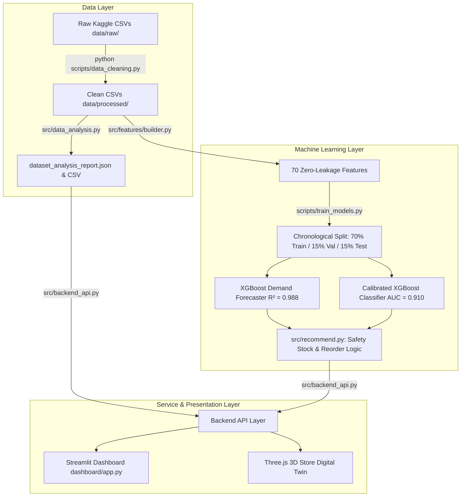

# STOCKSENSE End-to-End System Workflow Documentation

## Executive Overview
**STOCKSENSE** is an integrated, reproducible retail demand forecasting, stock-out risk prediction, and replenishment decision-intelligence platform.

Every pipeline stage — from raw CSV intake to backend analytics, ML training, API endpoints, 3D store digital twin, and frontend dashboard — operates on a **Single Source of Truth**: `data/processed/`.

---

## 1. High-Level System Architecture & Data Lineage



---

## 2. Step-by-Step Workflow Breakdown

### 1. Data Collection & Intake
- Raw datasets are read-only inputs stored in `data/raw/` (`external_factors.csv`, `inventory.csv`, `products.csv`, `stores.csv`, `transactions.csv`).
- Data consists of 97,510 raw records spanning 243 active retail operational days across 4 stores and 30 products.

### 2. Data Cleaning & Preprocessing (`scripts/data_cleaning.py`)
- Executed via `python scripts/data_cleaning.py`.
- **Missing Values**: Imputed 18 missing temperature records in `external_factors.csv` using city-level time-series forward/backward fill.
- **Inventory Balance Reconciliation**: Corrected 25 records where closing stock diverged from `opening + received - sold`.
- **Duplicates & Invalids**: Removed 1 exact duplicate transaction and 1 invalid transaction with negative quantity (`quantity = -4`).
- **Outliers**: Identified statistical outliers via IQR ($[Q_1 - 1.5 \times IQR, Q_3 + 1.5 \times IQR]$) and retained valid high-volume promotional bulk sales.
- **Referential Integrity**: 100% verified foreign key relationships across all datasets.
- **Clean Outputs**: Saved to `data/processed/` along with `cleaning_log.csv`, `data_quality_report.csv`, `outlier_report.csv`, `data_profiling_report.csv`, and `data_profiling_report.txt`.

### 3. Backend Empirical Analysis (`src/data_analysis.py`)
- Reads clean files directly from `data/processed/`.
- Computes gross revenue ($98.8M), total units sold (1.06M), total transactions (67.3k), inventory valuation ($1.64M), store revenue breakdowns, top/bottom performing products, and daily demand trends.
- Generates `data/processed/dataset_analysis_report.json` and `data/processed/dataset_analysis_report.csv`.

### 4. Feature Engineering & Target Construction (`src/features/builder.py` & `src/targets.py`)
- Builds 70 zero-leakage features using only information available at prediction time $t$:
  - **Time Features**: Day of week, month, week number, weekend flag, days to/from festivals and holidays.
  - **Lag Features**: Shifted 1, 7, 14, 28-day demand (`units_sold`).
  - **Rolling Window Features**: Shifted 7, 14, 28-day moving averages, std, min, max, growth rate, coefficient of variation.
  - **Inventory Features**: Days of inventory, stock cover vs lead time, reorder gap, past 30-day stockout frequency.
  - **Price & Promo Features**: Discount %, price-to-MRP ratio, price change, active promo flag, 7-day promo count.
- **Targets**: 7-day future demand `next_7_day_demand` (regression target) and 7-day stock-out risk flag `stockout_flag` (classification target).

### 5. Reproducibility & Model Training (`scripts/train_models.py`)
- Executed via `python scripts/train_models.py`.
- Splits data chronologically: **70% Train** (19,800 rows), **15% Validation** (4,200 rows), **15% Test** (4,320 rows).
- Benchmarks multiple algorithms (Linear/Ridge/Lasso Regression, Decision Tree, Random Forest, XGBoost, KNN, Naive Bayes, Logistic Regression).
- **Winning Models**:
  - **Demand Forecasting**: XGBoost Regressor ($MAE = 13.05$, $RMSE = 19.67$, $R^2 = 0.988$).
  - **Stock-Out Risk Prediction**: Calibrated XGBoost Classifier ($Accuracy = 83.82\%$, $F1 = 0.880$, $ROC-AUC = 0.910$).
- Saves artifacts: `models/demand_forecast_model.joblib`, `models/stockout_risk_model.joblib`, `models/training_report.json`, `reports/model_comparison_regression.csv`, `reports/model_comparison_classification.csv`, `reports/feature_dictionary.md`, `reports/model_justification.md`.

### 6. Backend API Bridge (`src/backend_api.py`)
- Provides backend python endpoints (`get_data_summary()`, `get_data_quality()`, `get_dataset_analysis()`, `get_sales_overview()`, `get_inventory_overview()`, `get_predictions()`, `get_recommendations()`, `get_model_metrics()`, `get_3d_digital_twin_data()`).
- Eliminates hardcoded values, mock data, or direct unvalidated CSV reading in the frontend.

### 7. Actionable Recommendations & Reorder Engine (`src/recommend.py`)
- Computes dynamic replenishment orders for every Store x Product combination:
  $$\text{Safety Stock} = z \times \sigma_{\text{error}} \times \sqrt{\text{lead\_days}} \quad (z = 1.645 \text{ for 95\% service level})$$
  $$\text{Recommended Reorder Quantity} = \max(0, \text{Reorder Level} + \text{Predicted 7-Day Demand} + \text{Safety Stock} - \text{Current Stock})$$
- Generates manager action alerts, risk categorization (HIGH, MEDIUM, LOW), and financial lost sales estimates.

### 8. Frontend Dashboard & 3D Digital Twin (`dashboard/app.py`)
- Interactive Streamlit app featuring 6 dedicated views:
  1. **🏠 Landing / Overview**: Project introduction, 3D hero animation, system architecture diagram, key KPI cards.
  2. **📊 Page 1: Dataset & Data Quality**: Read-only dataset status, missing value reduction, cleaning log, before vs after metrics.
  3. **📈 Page 2: Retail Intelligence (Analytics)**: Revenue, sales by store/category, top/bottom products, daily demand trend charts.
  4. **🤖 Page 3: AI Predictions**: Demand forecast and stock-out probabilities matrix with risk badges and filter controls.
  5. **🎯 Page 4: Smart Recommendations**: Dynamic replenishment action center with reorder quantities, manager advice, lost sales estimates.
  6. **🧊 Page 5: 3D Store Digital Twin**: Rotatable Three.js 3D supermarket aisle scene driven by live backend recommendation data.
  7. **🔬 Model & Data Transparency (Evaluator View)**: Full technical transparency view with model metrics, train/test split specs, JSON reports, and data lineage.

---

## 3. How to Run the Complete System

Follow these three simple steps from the project root directory:

### Step 1: Execute Data Cleaning & Preprocessing Pipeline
```bash
python scripts/data_cleaning.py
```
*Outputs clean datasets into `data/processed/` along with profiling, outlier, quality, and audit reports.*

### Step 2: Execute Reproducibility & Model Training Pipeline
```bash
python scripts/train_models.py
```
*Trains XGBoost demand forecaster and stockout classifier, evaluates models, and saves model files & training report to `models/`.*

### Step 3: Launch Frontend Dashboard App
```bash
python -m streamlit run dashboard/app.py
```
*Launches the interactive dashboard on `http://localhost:8501` (or next available port).*

---

## 4. Summary of Trained Model Evaluation Metrics

| Task | Winning Algorithm | Metric 1 | Metric 2 | Metric 3 | Metric 4 |
| :--- | :--- | :---: | :---: | :---: | :---: |
| **Demand Forecasting** | XGBoost Regressor | **MAE**: $13.05$ | **RMSE**: $19.67$ | **sMAPE**: $12.3\%$ | **$R^2$**: $0.988$ |
| **Stock-Out Prediction** | Calibrated XGBoost Classifier | **Accuracy**: $83.82\%$ | **F1 Score**: $0.880$ | **Precision**: $0.852$ | **ROC-AUC**: $0.910$ |
